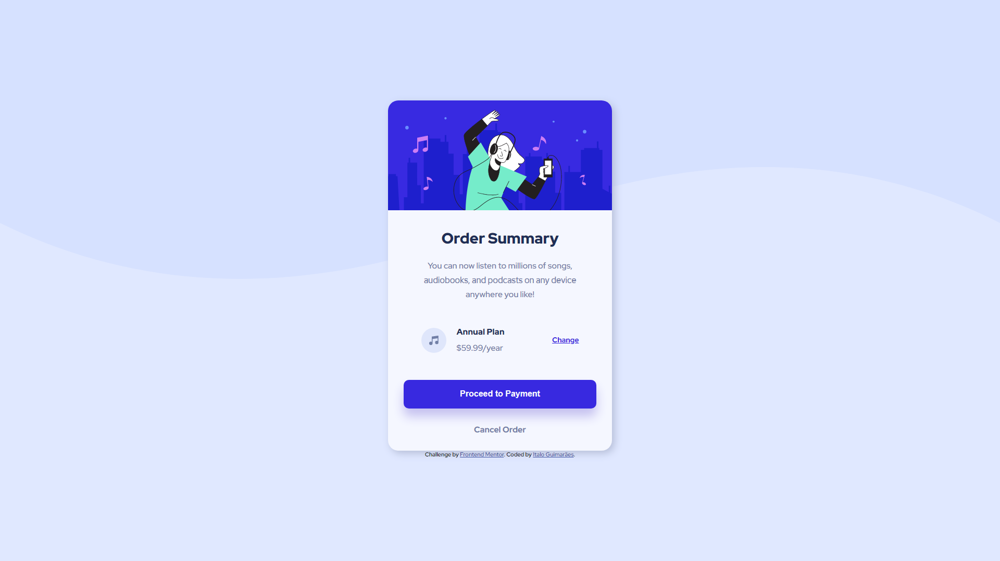

# Frontend Mentor - Order summary card solution

This is a solution to the [Order summary card challenge on Frontend Mentor](https://www.frontendmentor.io/challenges/order-summary-component-QlPmajDUj). Frontend Mentor challenges help you improve your coding skills by building realistic projects. 

## Table of contents

- [Overview](#overview)
  - [The challenge](#the-challenge)
  - [Screenshot](#screenshot)
  - [Links](#links)
- [My process](#my-process)
  - [Built with](#built-with)
  - [Useful resources](#useful-resources)
- [Author](#author)

## Overview

### The challenge

Users should be able to:

- See hover states for interactive elements

### Screenshot

### Links

- Solution URL: [Add solution URL here](https://your-solution-url.com)
- Live Site URL: [Add live site URL here](https://your-live-site-url.com)

## My process

### Built with

- Semantic markup with HTML5.
- Element styling with 'pure' CSS.
- Flexbox for positioning all components.
- Media Queries to set breakpoints for different layouts.

### Useful resources

- [Flexbox Guide](https://css-tricks.com/snippets/css/a-guide-to-flexbox/) - A very practical guide for any eventuality that arises in positioning when using flexbox.

## Author

- Frontend Mentor - [@KaimuraDev](https://www.frontendmentor.io/profile/KaimuraDev)
